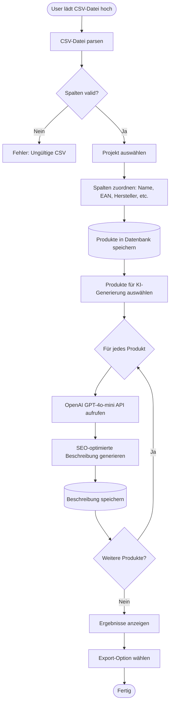
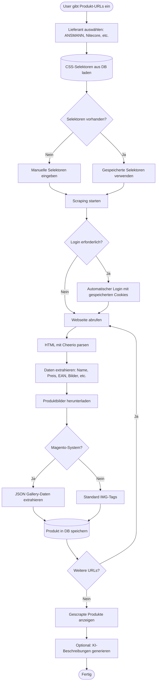
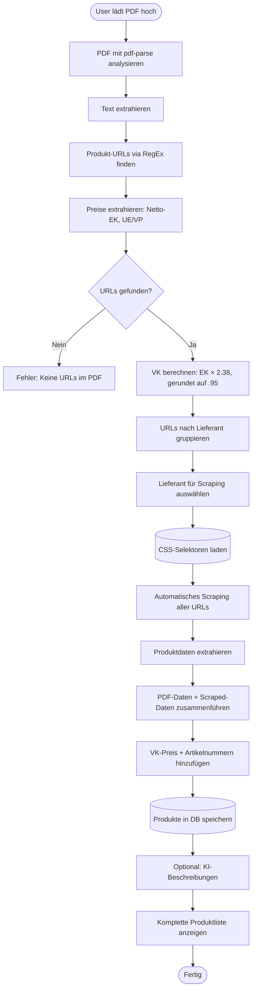
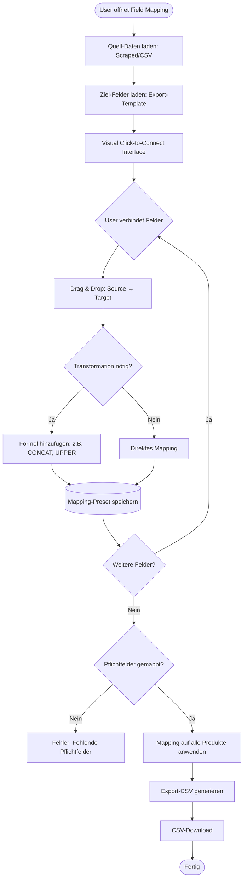
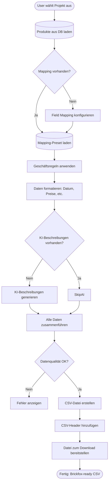
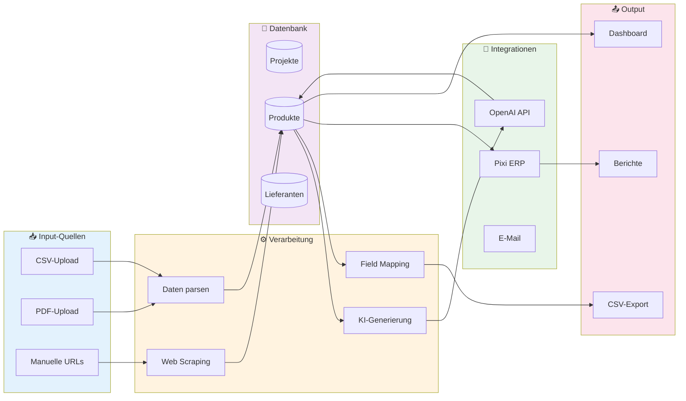
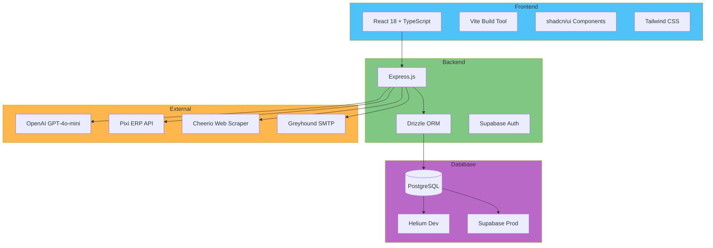

# PIMPilot - Workflow-Flussdiagramme

Dieses Dokument enthält visuelle Flussdiagramme für alle Hauptfunktionen von PIMPilot.

---

## 1. CSV Bulk-Import → KI-Produktbeschreibungen



**Dauer:** 2-5 Sekunden pro Produkt (abhängig von OpenAI API)

---

## 2. URL Web-Scraper → Produktdaten extrahieren



**Features:**
- Automatischer Login mit Session-Cookie-Persistierung
- Magento JSON Gallery-Parsing
- Intelligente CSS-Selektor-Erkennung
- Automatischer Bild-Download

---

## 3. PDF Auto-Scraper → Automatische Pipeline



**Besonderheit:**
- **VK-Formel:** `(Netto-EK × 2) + 19% = EK × 2.38`, immer auf `.95` gerundet
- **Dual Article Numbers:** Lieferant-Nr + Interne Nr (z.B. ANSMANN + A-Code)

---

## 4. Pixi ERP-Integration → Duplikat-Erkennung

```mermaid
flowchart TD
    Start([User wählt Projekt aus]) --> LoadProducts[(Produkte aus Projekt laden)]
    LoadProducts --> PrepareData[EAN-Codes extrahieren]
    PrepareData --> CallPixiAPI[Pixi ERP API aufrufen]
    CallPixiAPI --> FetchInventory[Bestandsdaten abrufen]
    FetchInventory --> CompareProducts{Für jedes Produkt}
    CompareProducts --> MatchEAN{EAN im Pixi-System?}
    MatchEAN -->|Ja| MarkExisting[Als "Existing" markieren]
    MatchEAN -->|Nein| MarkNew[Als "New" markieren]
    MarkExisting --> CheckStock[Lagerbestand prüfen]
    MarkNew --> NextProduct
    CheckStock --> UpdateStatus[Status aktualisieren]
    UpdateStatus --> NextProduct{Weitere Produkte?}
    NextProduct -->|Ja| CompareProducts
    NextProduct -->|Nein| GenerateReport[Vergleichsbericht erstellen]
    GenerateReport --> ShowResults[Ergebnisse anzeigen: New vs. Existing]
    ShowResults --> ExportCSV[CSV-Export mit Status]
    ExportCSV --> End([Fertig])
```

**Output:**
- Liste: Neue Produkte (nicht in Pixi)
- Liste: Bestehende Produkte (bereits in Pixi)
- Lagerbestandsinformationen

---

## 5. Field Mapping → Flexibles Export-System



**Features:**
- Wiederverwendbare Mapping-Presets
- Custom Transformations (CONCAT, SPLIT, UPPER, etc.)
- Validierung von Pflichtfeldern

---

## 6. Brickfox/ERP CSV-Export → Finaler Export



**Output-Format:**
- Brickfox-kompatible CSV
- Alle Pflichtfelder gefüllt
- SEO-optimierte Beschreibungen
- Korrekte Preisformatierung

---

## 7. Gesamtübersicht: Kompletter PIMPilot-Workflow



---

## Zeitschätzungen pro Workflow

| Workflow | Dauer (Single Product) | Dauer (100 Products) |
|----------|------------------------|----------------------|
| CSV Import | 1 Sekunde | 10 Sekunden |
| URL Scraper | 3-5 Sekunden | 5-8 Minuten |
| PDF Auto-Scraper | 5-10 Sekunden | 8-15 Minuten |
| KI-Generierung | 2-4 Sekunden | 3-7 Minuten |
| Pixi-Vergleich | 1 Sekunde | 15-30 Sekunden |
| Field Mapping | Einmalig 5 Min | Wiederverwendbar |
| CSV-Export | 1 Sekunde | 5 Sekunden |

**Gesamt:** Von PDF bis fertiger CSV: **15-20 Minuten** für 100 Produkte

---

## Technologie-Stack



---

## Lizenz & Kontakt

**PIMPilot** - Produktdaten-Management automatisiert  
© 2025 | Alle Rechte vorbehalten

Für Fragen: [Kontaktformular](/contact)
