# PIMPilot - Workflow-Flussdiagramme

Dieses Dokument enthält visuelle Flussdiagramme für alle Hauptfunktionen von PIMPilot.

---

## 1. CSV Bulk-Import → KI-Produktbeschreibungen

```mermaid
flowchart TD
    Start([User lädt CSV-Datei hoch]) --> Parse[CSV-Datei parsen]
    Parse --> Validate{Spalten valid?}
    Validate -->|Nein| Error1[Fehler: Ungültige CSV]
    Validate -->|Ja| SelectProject[Projekt auswählen]
    SelectProject --> MapColumns[Spalten zuordnen: Name, EAN, Hersteller, etc.]
    MapColumns --> ImportDB[(Produkte in Datenbank speichern)]
    ImportDB --> SelectProducts[Produkte für KI-Generierung auswählen]
    SelectProducts --> AILoop{Für jedes Produkt}
    AILoop --> CallOpenAI[OpenAI GPT-4o-mini API aufrufen]
    CallOpenAI --> GenerateDesc[SEO-optimierte Beschreibung generieren]
    GenerateDesc --> SaveDesc[(Beschreibung speichern)]
    SaveDesc --> NextProduct{Weitere Produkte?}
    NextProduct -->|Ja| AILoop
    NextProduct -->|Nein| ShowResults[Ergebnisse anzeigen]
    ShowResults --> ExportOption[Export-Option wählen]
    ExportOption --> End([Fertig])
```



**Dauer:** 2-5 Sekunden pro Produkt (abhängig von OpenAI API)

---

## 2. URL Web-Scraper → Produktdaten extrahieren


**Features:**
- Automatischer Login mit Session-Cookie-Persistierung
- Magento JSON Gallery-Parsing
- Intelligente CSS-Selektor-Erkennung
- Automatischer Bild-Download

---

## 3. PDF Auto-Scraper → Automatische Pipeline


**Besonderheit:**
- **VK-Formel:** `(Netto-EK × 2) + 19% = EK × 2.38`, immer auf `.95` gerundet
- **Dual Article Numbers:** Lieferant-Nr + Interne Nr (z.B. ANSMANN + A-Code)

---

## 4. Pixi ERP-Integration → Duplikat-Erkennung

```mermaid
flowchart TD
    Start([User wählt Projekt aus]) --> LoadProducts[(Produkte aus Projekt laden)]
    LoadProducts --> PrepareData[EAN-Codes extrahieren]
    PrepareData --> CallPixiAPI[Pixi ERP API aufrufen]
    CallPixiAPI --> FetchInventory[Bestandsdaten abrufen]
    FetchInventory --> CompareProducts{Für jedes Produkt}
    CompareProducts --> MatchEAN{EAN im Pixi-System?}
    MatchEAN -->|Ja| MarkExisting[Als "Existing" markieren]
    MatchEAN -->|Nein| MarkNew[Als "New" markieren]
    MarkExisting --> CheckStock[Lagerbestand prüfen]
    MarkNew --> NextProduct
    CheckStock --> UpdateStatus[Status aktualisieren]
    UpdateStatus --> NextProduct{Weitere Produkte?}
    NextProduct -->|Ja| CompareProducts
    NextProduct -->|Nein| GenerateReport[Vergleichsbericht erstellen]
    GenerateReport --> ShowResults[Ergebnisse anzeigen: New vs. Existing]
    ShowResults --> ExportCSV[CSV-Export mit Status]
    ExportCSV --> End([Fertig])
```

**Output:**
- Liste: Neue Produkte (nicht in Pixi)
- Liste: Bestehende Produkte (bereits in Pixi)
- Lagerbestandsinformationen

---

## 5. Field Mapping → Flexibles Export-System

```mermaid
flowchart TD
    Start([User öffnet Field Mapping]) --> LoadSource[Quell-Daten laden: Scraped/CSV]
    LoadSource --> LoadTarget[Ziel-Felder laden: Export-Template]
    LoadTarget --> ShowMapping[Visual Click-to-Connect Interface]
    ShowMapping --> UserConnect{User verbindet Felder}
    UserConnect --> DragDrop[Drag & Drop: Source → Target]
    DragDrop --> Transform{Transformation nötig?}
    Transform -->|Ja| AddFormula[Formel hinzufügen: z.B. CONCAT, UPPER]
    Transform -->|Nein| DirectMap[Direktes Mapping]
    AddFormula --> SaveMapping
    DirectMap --> SaveMapping[(Mapping-Preset speichern)]
    SaveMapping --> MoreFields{Weitere Felder?}
    MoreFields -->|Ja| UserConnect
    MoreFields -->|Nein| ValidateMapping{Pflichtfelder gemappt?}
    ValidateMapping -->|Nein| Error1[Fehler: Fehlende Pflichtfelder]
    ValidateMapping -->|Ja| ApplyMapping[Mapping auf alle Produkte anwenden]
    ApplyMapping --> GenerateExport[Export-CSV generieren]
    GenerateExport --> DownloadCSV[CSV-Download]
    DownloadCSV --> End([Fertig])
```



**Features:**
- Wiederverwendbare Mapping-Presets
- Custom Transformations (CONCAT, SPLIT, UPPER, etc.)
- Validierung von Pflichtfeldern

---

## 6. Brickfox/ERP CSV-Export → Finaler Export

```mermaid
flowchart TD
    Start([User wählt Projekt aus]) --> LoadProducts[(Produkte aus DB laden)]
    LoadProducts --> CheckMapping{Mapping vorhanden?}
    CheckMapping -->|Nein| CreateMapping[Field Mapping konfigurieren]
    CheckMapping -->|Ja| LoadMapping[(Mapping-Preset laden)]
    CreateMapping --> LoadMapping
    LoadMapping --> ApplyRules[Geschäftsregeln anwenden]
    ApplyRules --> FormatData[Daten formatieren: Datum, Preise, etc.]
    FormatData --> EnrichAI{KI-Beschreibungen vorhanden?}
    EnrichAI -->|Nein| GenerateAI[KI-Beschreibungen generieren]
    EnrichAI -->|Ja| SkipAI
    GenerateAI --> MergeData
    SkipAI --> MergeData[Alle Daten zusammenführen]
    MergeData --> ValidateData{Datenqualität OK?}
    ValidateData -->|Nein| ShowErrors[Fehler anzeigen]
    ValidateData -->|Ja| GenerateCSV[CSV-Datei erstellen]
    GenerateCSV --> AddHeaders[CSV-Header hinzufügen]
    AddHeaders --> ExportFile[Datei zum Download bereitstellen]
    ExportFile --> End([Fertig: Brickfox-ready CSV])
```



**Output-Format:**
- Brickfox-kompatible CSV
- Alle Pflichtfelder gefüllt
- SEO-optimierte Beschreibungen
- Korrekte Preisformatierung

---

## 7. Gesamtübersicht: Kompletter PIMPilot-Workflow

```mermaid
flowchart LR
    subgraph Input["📥 Input-Quellen"]
        CSV[CSV-Upload]
        PDF[PDF-Upload]
        URL[Manuelle URLs]
    end

    subgraph Processing["⚙️ Verarbeitung"]
        Parse[Daten parsen]
        Scrape[Web Scraping]
        AI[KI-Generierung]
        Map[Field Mapping]
    end

    subgraph Database["💾 Datenbank"]
        Projects[(Projekte)]
        Products[(Produkte)]
        Suppliers[(Lieferanten)]
    end

    subgraph Integration["🔗 Integrationen"]
        Pixi[Pixi ERP]
        OpenAI[OpenAI API]
        SMTP[E-Mail]
    end

    subgraph Output["📤 Output"]
        ExportCSV[CSV-Export]
        Dashboard[Dashboard]
        Reports[Berichte]
    end

    CSV --> Parse
    PDF --> Parse
    URL --> Scrape
    Parse --> Products
    Scrape --> Products
    Products --> AI
    AI --> OpenAI
    OpenAI --> Products
    Products --> Map
    Map --> ExportCSV
    Products --> Pixi
    Pixi --> Reports
    Products --> Dashboard

    style Input fill:#e3f2fd
    style Processing fill:#fff3e0
    style Database fill:#f3e5f5
    style Integration fill:#e8f5e9
    style Output fill:#fce4ec
```



---

## Zeitschätzungen pro Workflow

| Workflow | Dauer (Single Product) | Dauer (100 Products) |
|----------|------------------------|----------------------|
| CSV Import | 1 Sekunde | 10 Sekunden |
| URL Scraper | 3-5 Sekunden | 5-8 Minuten |
| PDF Auto-Scraper | 5-10 Sekunden | 8-15 Minuten |
| KI-Generierung | 2-4 Sekunden | 3-7 Minuten |
| Pixi-Vergleich | 1 Sekunde | 15-30 Sekunden |
| Field Mapping | Einmalig 5 Min | Wiederverwendbar |
| CSV-Export | 1 Sekunde | 5 Sekunden |

**Gesamt:** Von PDF bis fertiger CSV: **15-20 Minuten** für 100 Produkte

---

## Technologie-Stack


---

## Lizenz & Kontakt

**PIMPilot** - Produktdaten-Management automatisiert  
© 2025 | Alle Rechte vorbehalten

Für Fragen: [Kontaktformular](/contact)
